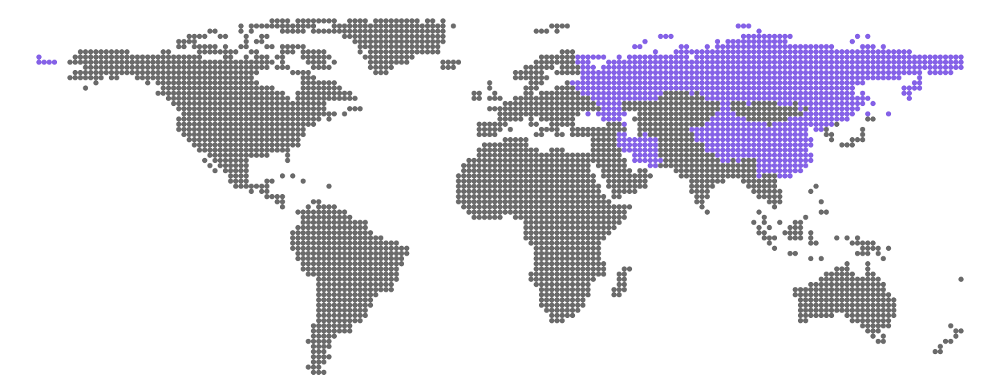

    <h1>X-UI API with PHP</h1>
    
<a href="https://t.me/xQueryTeam?direct">Contact me</a> to participate in project development or become a sponsor

    
    
A functional class for <a href="https://github.com/MHSanaei/3x-ui/">3X-UI</a> API

    <table>
        <thead>
            <tr>
                <th>Project</th>
                <th>Description</th>
                <th>Links</th>
            </tr>
        </thead>
        <tbody>
            <tr>
                <td>👉 <b>V2Ray API</b></td>
                <td>API Wrapper for 3x-ui and x-ui panel</td>
                <td>
                    <a href="https://github.com/mobinjavari/v2ray-api-php">Github</a> / 
                    <a href="https://mobinjavari.github.io/v2ray-api-php/">Docs</a>
                </td>
            </tr>
            <tr>
                <td><b>Marzban API</b></td>
                <td>API Wrapper for Marzban panel</td>
                <td>
                    <a href="https://github.com/mobinjavari/marzban-api-php">Github</a>
                </td>
            </tr>
            <tr>
                <td><b>Marzneshin API</b></td>
                <td>API Wrapper for Marzneshin panel</td>
                <td>
                    <a href="https://github.com/mobinjavari/marzneshin-api-php">Github</a>
                </td>
            </tr>
        </tbody>
    </table>

